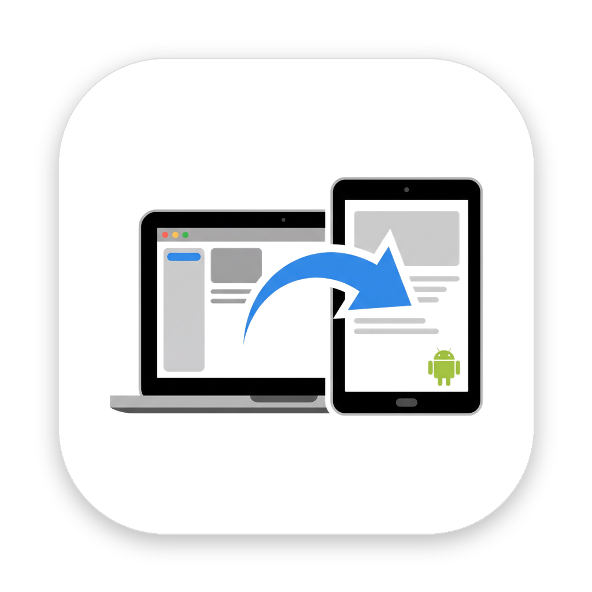

<p align="center"></p>

# Spanly for Mac

Use an Android tablet as a second display for your Mac over a USB cable, with touch.

This repository is the Mac app. The tablet needs the **Spanly** Android app. For Windows and
Linux, see [spanly-desktop](https://github.com/caigenix/spanly-desktop) (beta).

- **Real extended display**: a virtual display sized to the tablet, Retina by default.
- **Fast, wired**: hardware HEVC/H.264 encoding on the Mac and hardware decoding on the tablet,
  over raw USB (Android Open Accessory mode). About 57 fps and ~40 ms from capture to decoded frame
  at 2304×1440 on a Redmi Pad 2.
- **Touch like a tablet**: swipe to scroll (with momentum), tap to click, hold-and-move to drag,
  hold or two-finger tap to right-click, pinch to zoom.
- **Extend or mirror**: a separate second screen, or the same picture as the Mac. Turn the tablet
  and the display turns with it (portrait or landscape), keeping its windows.
- **Pen and sound**: stylus hover and pressure; the Mac's sound on the tablet (alongside the Mac,
  or the tablet only); the tablet's own sound on the Mac while its screen is shown there; and the
  tablet's microphone as a Mac microphone.
- **Wi-Fi too**: plug in once to pair, then connect wirelessly. The connection is encrypted and
  the bitrate adapts to the network.
- **The other way round**: show the tablet's own screen in a window on the Mac, and control it
  with the Mac's mouse and keyboard.
- **Follows the Mac**: starts when you plug the tablet in, sleeps and wakes with the Mac's display.

## Requirements

- macOS 14 or later, Apple silicon or Intel.
- An Android 11+ tablet or phone with the Spanly app.
- A USB cable that carries data.

## Install

Download `Spanly-mac.zip` from [Releases](../../releases), unzip it and move **Spanly** to
Applications. Or build and install it yourself:

```sh
scripts/install-mac.sh             # build, install to ~/Applications, start
scripts/install-mac.sh --uninstall
```

Spanly lives in the menu bar (no Dock icon) and opens at login. On first launch it asks for:

- **Screen Recording**: to show the Mac's screen on the tablet.
- **Accessibility**: to turn touches into clicks and scrolls.

Then connect the tablet. The Mac asks whether to use it as a second screen, and the tablet asks
whether to open Spanly for the USB accessory; tick **Always**.

## Using it

| Menu | |
|---|---|
| Show Tablet Screen on Mac | the tablet's own screen in a window, controlled with mouse and keyboard (Esc = Back) |
| Tablet | which connected Android device to use (only that device is ever touched) |
| Mode | Extend (separate second screen) or Mirror (same as the Mac) |
| Resolution | Automatic, Retina (sharpest) or Standard (lightest) |
| Position | where the display sits next to the main screen, or leave it where you arrange it |
| Allow Wi-Fi Connection | (on by default) let tablets that were plugged in once connect wirelessly; *Forget Paired Tablets* revokes them |
| Sound | Mac Only, Mac and Tablet, or Tablet Only (mutes the Mac's speakers while connected) |
| Use Tablet as Microphone | the tablet's mic appears on the Mac as **Spanly Microphone** (the first time, *Install Spanly Microphone…* adds a small audio driver and asks for your password) |
| Return Pointer to Mac After Touch | put the pointer back on the Mac screen after each touch |
| Open at Login, Show Log, Quit | |

The log is at `~/Library/Logs/Spanly.log`.

No router? Turn on the tablet's hotspot and join it from the Mac: Spanly finds the tablet
by itself (the Mac then has no other Wi-Fi internet unless the tablet shares mobile data). If you
use a phone's hotspot for both, set its band to 5 GHz: 2.4 GHz is several times slower.

Two tablets at once: plug one in and connect another over Wi-Fi (or both over Wi-Fi). Each gets its
own display, placed beside the other; the Mac's sound and the microphone use the first one.

With Wi-Fi allowed, unplugging the cable keeps the display: while on USB the tablet keeps an idle
Wi-Fi connection ready, carries on over it as soon as the cable comes out, and moves back to USB
when you plug in again.

Tip: in System Settings → Desktop & Dock, set *Click wallpaper to reveal desktop* to *Only in
Stage Manager*, or a tap on an empty part of the tablet hides all your windows.

Controlling the tablet from the Mac needs **Spanly: control from Mac** turned on once in the
tablet's Settings › Accessibility.

Automation: `open spanly://show-tablet` and `open spanly://hide-tablet` (for example
from Shortcuts). Command-line options (`Spanly.app/Contents/MacOS/spanly --help`)
override the menu settings for one run, for example `--stats` to log frame rate and latency.

## How it works

```
CGVirtualDisplay → ScreenCaptureKit → VideoToolbox ─┐        ┌─ MediaCodec → screen
                                                   USB (Android Open Accessory)
Pointer (CGEvent) ◀──── touch / scroll / zoom ──────┘        └─ gesture recognition
```

| File | |
|---|---|
| `Controller.swift` (+ `+Menu`, `+Share`, `+Mic`) | listeners, matching connections to tablets, settings |
| `TabletSession.swift` (+ `+Hello`) | one tablet: its display, capture, encoder, adaptive bitrate |
| `FlowControl.swift` | frames in flight, ACKs, latency |
| `VirtualScreen.swift` | the virtual display (private `CGVirtualDisplay` API), rotation |
| `Capture.swift`, `Encoder.swift`, `AudioPCM.swift` | ScreenCaptureKit video and sound, VideoToolbox encoding |
| `PCMPlayer.swift`, `MacSpeakers.swift`, `Microphone.swift` (+ `Controller+Mic`) | the tablet's sound and microphone on the Mac, muting the Mac for *Tablet Only* |
| `mac/Driver/` | the "Spanly Microphone" audio driver (an AudioServerPlugIn loopback device, in C) |
| `Usb.swift` | Android Open Accessory link over libusb |
| `WifiLink.swift`, `WifiCrypto.swift` | Bonjour + encrypted Wi-Fi links |
| `Server.swift`, `Adb.swift` | TCP fallback through `adb reverse` |
| `TabletWindow.swift` | the tablet's own screen in a Mac window, and input back to it |
| `Protocol.swift` | message framing ([PROTOCOL.md](PROTOCOL.md)) |
| `Pointer.swift` | gestures to mouse, scroll and keyboard events |
| `MenuBar.swift`, `Settings.swift`, `Permissions.swift` | the UI |

## Build

```sh
swift build --package-path mac      # needs: brew install libusb pkg-config
swift test --package-path mac
scripts/build-mac-app.sh            # universal Spanly.app with libusb bundled -> mac/dist/
python3 scripts/make-icons.py       # regenerate the icon from assets/icon-source.jpeg
```

`build-mac-app.sh` signs with `$SPANLY_SIGN_IDENTITY` (for example a Developer ID). Otherwise
it uses a local `Spanly Local Signing` certificate if you made one, which keeps the permissions
across rebuilds, or else ad-hoc signing.

## Releases

Pushing a tag like `v0.2.0` builds the app on GitHub Actions and attaches `Spanly-mac.zip` to a
GitHub release. With these repository secrets set, it is also signed with a Developer ID and
notarized, so it opens without Gatekeeper warnings:

| Secret | |
|---|---|
| `MACOS_CERTIFICATE_P12` | base64 of the Developer ID Application certificate (.p12) |
| `MACOS_CERTIFICATE_PASSWORD` | its password |
| `MACOS_SIGN_IDENTITY` | e.g. `Developer ID Application: Name (TEAMID)` |
| `NOTARY_KEY_P8`, `NOTARY_KEY_ID`, `NOTARY_ISSUER_ID` | App Store Connect API key for notarization |

Spanly can't be on the Mac App Store: it uses the private `CGVirtualDisplay` API and needs
Accessibility access, which the App Store sandbox doesn't allow.

## License

[GPL-3.0](LICENSE). libusb is LGPL-2.1 and is bundled as a separate dynamic library.
